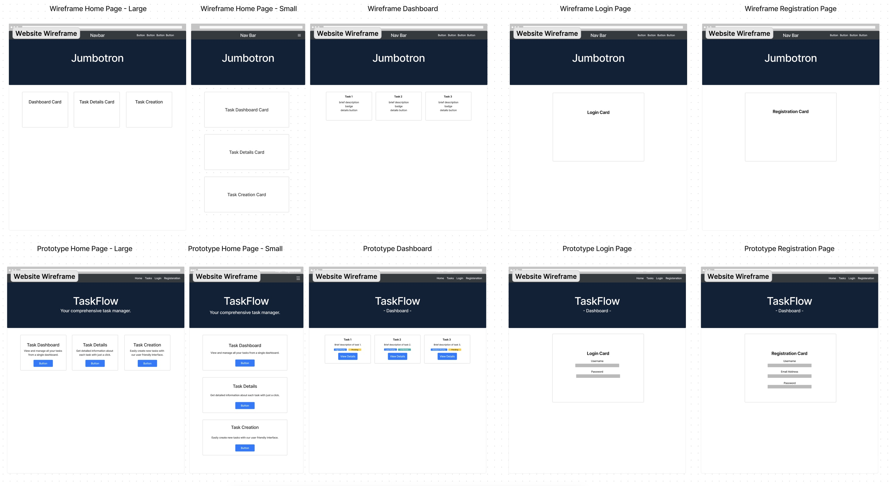

Task Management Application

Hey friends! Welcome to my Task Management Application project! 🌟 This project has been a labor of love, crafted to help you effortlessly organize and track your tasks. I’ve poured a lot of thought into making it both functional and visually appealing by focusing on UI/UX design and harnessing the power of Bootstrap.

Features

User Interface Design

Sketches and Prototypes: I kicked things off by sketching out a couple of wireframes and mid-fidelity prototypes using Figma. This really helped me nail down the layout and flow of the app.

Bootstrap Goodies: I leaned on Bootstrap’s Navbar, Cards, and Forms to give the app a clean, consistent, and appealing look.

Task Management Features

Home Page: This is your gateway to the app! The landing page features a Navbar, a welcoming Jumbotron, and/or Header Image. I used Cards to highlight the app’s key features and get you started on the right foot.

Task Dashboard Page: The dashboard is the beating heart of this app. It’s where you can manage all your tasks effortlessly. I used Cards, Forms, and Buttons to create an interactive dashboard that displays essential info for each task, like Name, Description, and Due Date.

Task Details Page: Need more details on a task? This page has got you covered with a comprehensive view of each task using Cards.

Task Creation Page: Adding new tasks is a breeze! I developed a form layout using Bootstrap Forms and Input Groups to make this process smooth and easy.

Register Page: New here? No problem! There’s a registration form packed with Bootstrap Form components and validation to help you sign up quickly and securely.

Login Page: Logging in is straightforward with a form that includes input fields for your username and password, along with validation to ensure everything’s correct.

Bootstrap Integration
Grid System: I tapped into Bootstrap’s grid system to design the layout and style the components across all the HTML pages.
Responsive Design: The app is fully responsive and looks great on any device, thanks to Bootstrap’s responsive grid and utilities.
User Experience Enhancements: Navigation is smooth and intuitive with the help of a Bootstrap Navbar and Dropdown menus.

Thanks so much for checking out my Task Management Application project! I hope it becomes your go-to tool for task management. If you have any questions or feedback, don’t hesitate to reach out. Let’s make task managing a breeze! 🚀

https://github.com/Winter-Krimmert/Task-Management-Application-Project

# Task Management Application

## Wireframes

### Home Page Wireframe

